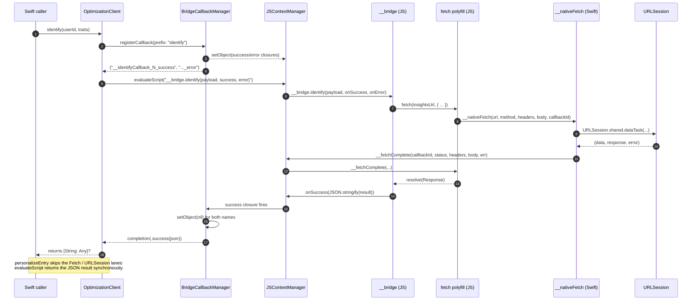

# Native mobile SDK architecture

Use this document to understand how the native iOS and Android SDKs share one TypeScript core by
running it inside an embedded JavaScript engine on the device, and how that JavaScript core reaches
back out to native primitives — `URLSession`, `OkHttp`, `DispatchQueue`, `Handler`, `OSLog`,
`Logcat` — through a small set of polyfill bindings registered before the bundle evaluates.

For platform-specific nuances, see [iOS SDK bridge](./ios-sdk-bridge.md) and
[Android SDK bridge](./android-sdk-bridge.md). For step-by-step contributor onboarding, see
[Contributing to the iOS SDK](../guides/contributing-to-the-ios-sdk.md) and
[Contributing to the Android SDK](../guides/contributing-to-the-android-sdk.md).

  
Table of Contents

- [1. One TypeScript core, two UMD bundles](#1-one-typescript-core-two-umd-bundles)
- [2. Polyfills are prepended at build time](#2-polyfills-are-prepended-at-build-time)
- [3. Native polyfill bindings](#3-native-polyfill-bindings)
- [4. End-to-end call flow](#4-end-to-end-call-flow)
  - [Sequence diagram](#sequence-diagram)
  - [Async path: identify and screen](#async-path-identify-and-screen)
  - [Sync path: personalizeEntry](#sync-path-personalizeentry)
- [5. State push-back from JS to native](#5-state-push-back-from-js-to-native)
- [6. Threading and lifecycle](#6-threading-and-lifecycle)
- [Where to go next](#where-to-go-next)

## 1. One TypeScript core, two UMD bundles

The SDK is one TypeScript source tree under
[`packages/universal/optimization-js-bridge/src/`](../../packages/universal/optimization-js-bridge/),
compiled by Rslib into two UMD bundles that differ only in which package name they stamp into
analytics `library.name`:

| Bundle                               | Consumer                                      | Engine                                  |
| ------------------------------------ | --------------------------------------------- | --------------------------------------- |
| `optimization-ios-bridge.umd.js`     | [`packages/ios`](../../packages/ios/)         | JavaScriptCore (`JSContext`)            |
| `optimization-android-bridge.umd.js` | [`packages/android`](../../packages/android/) | QuickJS (`io.github.dokar3:quickjs-kt`) |

The bridge package's `postbuild` script copies each UMD into the corresponding native package — the
iOS bundle into `Sources/ContentfulOptimization/Resources/`, the Android bundle into
`src/main/assets/`. From there it is packaged as a Swift Package resource or an Android asset and
read into memory at runtime by the platform's context manager.

The UMD exposes a single `globalThis.__bridge` object with methods like `identify`, `screen`,
`personalizeEntry`, `flush`, `consent`, `reset`, `getProfile`, `getPreviewState`, and the preview-
panel override mutators. Native code never imports a JavaScript symbol by any other path.

## 2. Polyfills are prepended at build time

The bundle assumes a browser-ish global environment — `console`, `setTimeout`, `fetch`,
`crypto.randomUUID`, `URL`, `URLSearchParams`, `AbortController`, `TextEncoder`. Neither
JavaScriptCore nor QuickJS ships those. The bridge build prepends eight polyfill scripts to the
emitted UMD as raw text before the IIFE, so each polyfill's top-level `var` and `function`
declarations bind on the global object exactly as if they had been loaded as separate scripts.

The prepend is implemented by a custom rspack plugin in
[`rslib.config.ts`](../../packages/universal/optimization-js-bridge/rslib.config.ts) (the built-in
`BannerPlugin` is unsuitable because it would template-substitute `[id]` inside polyfill code such
as `__timerCallbacks[id]`). The concatenation helper lives in
[`lib/build-tools/src/rslib.ts`](../../lib/build-tools/src/rslib.ts) as `concatPolyfills`.

The load order is load-bearing — `timers` must precede `abort-controller`, `console` must come first
so anything that logs during its own initialization can do so:

| Order | Polyfill            | Installs on `globalThis`                                                     | Native binding it consumes                   |
| ----- | ------------------- | ---------------------------------------------------------------------------- | -------------------------------------------- |
| 1     | `console`           | `console.log/warn/error/info/debug`                                          | `__nativeLog`                                |
| 2     | `timers`            | `setTimeout`, `clearTimeout`, `setInterval`, `clearInterval`, `__timerFired` | `__nativeSetTimeout`, `__nativeClearTimeout` |
| 3     | `fetch`             | `fetch`, `__fetchComplete`                                                   | `__nativeFetch`                              |
| 4     | `crypto`            | `crypto.randomUUID`, `crypto.getRandomValues`                                | `__nativeRandomUUID`                         |
| 5     | `url`               | `URL`, `URLSearchParams`                                                     | —                                            |
| 6     | `abort-controller`  | `AbortController`, `AbortSignal.timeout`                                     | —                                            |
| 7     | `promise-utilities` | `queueMicrotask`, `Promise.withResolvers` (when missing)                     | —                                            |
| 8     | `text-encoding`     | `TextEncoder`, `TextDecoder` (when missing)                                  | —                                            |

The native polyfill bindings — the `__native*` globals in the right column — must already exist on
the global object when the prepended polyfills evaluate. That ordering is the responsibility of the
per-platform context manager described next.

## 3. Native polyfill bindings

Each platform's context manager registers the same five `__native*` globals into the JS engine
before the UMD evaluates. The contract is identical; the implementation is platform-native:

| Binding                | iOS implementation                                                                                                            | Android implementation                                                                                                   |
| ---------------------- | ----------------------------------------------------------------------------------------------------------------------------- | ------------------------------------------------------------------------------------------------------------------------ |
| `__nativeLog`          | `@convention(block)` closure → `JSContextManager.onLog`                                                                       | `__native.log` (via `qjs.define`) → `NativeImpl.log`                                                                     |
| `__nativeSetTimeout`   | `DispatchQueue.main.asyncAfter`, work item stored in `TimerStore`, fires `__timerFired(id)` in JS                             | `scope.launch { delay(ms); evaluateJS("__timerFired(id)") }`, job stored in `TimerStore`                                 |
| `__nativeClearTimeout` | Cancels the `DispatchWorkItem` in `TimerStore`                                                                                | Cancels the `Job` in `TimerStore`                                                                                        |
| `__nativeRandomUUID`   | `UUID().uuidString.lowercased()`                                                                                              | `UUID.randomUUID().toString()`                                                                                           |
| `__nativeFetch`        | `URLSession.shared.dataTask`, response delivered to `__fetchComplete(callbackId, status, headers, body, error)` on main queue | `OkHttpClient.newCall(...).enqueue`, response delivered to `__fetchComplete(...)` via `scope.launch { evaluateJS(...) }` |

On iOS the five globals are set directly on the `JSContext` via `setObject(_:forKeyedSubscript:)`.
On Android the `quickjs-kt` `qjs.define("__native") { function(...) }` DSL exposes the methods on a
`__native` object, and a five-line bootstrap script aliases each one to the matching `__native*`
global — that way the prepended polyfills can call `__nativeFetch(...)` on either platform without
caring how the binding was installed.

Detail beyond this point — JavaScriptCore exception handlers, `os_signpost` markers, the
`quickjs-kt` single-threaded executor — is platform-specific. See
[iOS SDK bridge](./ios-sdk-bridge.md) and [Android SDK bridge](./android-sdk-bridge.md).

## 4. End-to-end call flow

The flow below is illustrated for iOS. Android uses the same flow with the engine substitutions
listed above (`JSContext.evaluateScript` ↔ `qjs.evaluate`, `URLSession` ↔ `OkHttp`,
`DispatchQueue.main` ↔ a coroutine on `Dispatchers.Main`).

### Sequence diagram

### Async path: identify and screen

The methods that round-trip through the Insights API — `identify`, `page`, `screen`, `trackView`,
`trackClick`, `flush` — are all async on the Swift / Kotlin surface because the JS-side handlers
return a `Promise`. The bridge cannot pass JS function objects back through `evaluateScript`'s
return value, so it uses a name-passing convention instead:

1. `OptimizationClient.identify(userId, traits)` builds a JSON payload and calls
   `bridgeCallAsyncJSON(method: "identify")`
   ([`OptimizationClient.swift:120–131`](../../packages/ios/ContentfulOptimization/Sources/ContentfulOptimization/Core/OptimizationClient.swift)).
2. `BridgeCallbackManager.registerCallback` mints a unique id `N` and registers two Swift closures
   on the JS global as `__identifyCallback_N_success` and `__identifyCallback_N_error`
   ([`BridgeCallbackManager.swift:21–47`](../../packages/ios/ContentfulOptimization/Sources/ContentfulOptimization/Bridge/BridgeCallbackManager.swift)).
3. `JSContextManager.callAsync` evaluates
   `__bridge.identify({"userId":...,"traits":...}, __identifyCallback_N_success, __identifyCallback_N_error)`
   ([`JSContextManager.swift:88–141`](../../packages/ios/ContentfulOptimization/Sources/ContentfulOptimization/Bridge/JSContextManager.swift)).
4. The JS bridge calls into `CoreStateful.identify(payload)`, which eventually invokes the `fetch`
   polyfill. `fetch` allocates a callback id, registers its own resolver, and calls
   `__nativeFetch(url, method, headersJSON, body, callbackId)`.
5. The Swift fetch binding runs `URLSession.shared.dataTask`, then delivers the response on the main
   queue by calling
   `ctx.objectForKeyedSubscript("__fetchComplete")?.call(withArguments: [callbackId, status, headers, body, errorMsg])`
   ([`NativePolyfills.swift:117–175`](../../packages/ios/ContentfulOptimization/Sources/ContentfulOptimization/Polyfills/NativePolyfills.swift)).
6. `__fetchComplete` resolves the JS-side fetch promise; the resulting chain inside `__bridge` runs
   `onSuccess(JSON.stringify(result))` (or `onError(message)`), which invokes the matching Swift
   closure registered in step 2.
7. The Swift closure clears both registered globals and resumes the awaiting
   `withCheckedThrowingContinuation`, returning a `[String: Any]?` to the original caller.

The error path is symmetric. If `__bridge.identify` rejects, the JS bundle calls
`__identifyCallback_N_error(message)`, the Swift error closure surfaces an
`OptimizationError.bridgeError`, and both globals are cleared.

`screen(name, properties)` follows exactly the same pattern with a different method name in step 3.

### Sync path: personalizeEntry

`personalizeEntry` is purely a local resolution against the in-memory profile and the
personalizations already loaded; it does no network I/O. The bridge implements it as a synchronous
function that returns a JSON string, so the call shape collapses:

1. `OptimizationClient.personalizeEntry(baseline, personalizations)` JSON-encodes its arguments and
   calls `bridge.callSync(method: "personalizeEntry", args: ...)`
   ([`OptimizationClient.swift:188–223`](../../packages/ios/ContentfulOptimization/Sources/ContentfulOptimization/Core/OptimizationClient.swift)).
2. `JSContextManager.callSync` runs
   `ctx.evaluateScript("__bridge.personalizeEntry(<baselineJSON>, <pJSON>)")` and returns the
   `JSValue`
   ([`JSContextManager.swift:145–165`](../../packages/ios/ContentfulOptimization/Sources/ContentfulOptimization/Bridge/JSContextManager.swift)).
3. The bridge returns a JSON-encoded `{ entry, personalization }` object; the client decodes it into
   a `PersonalizedResult`.

The other sync methods — `consent`, `reset`, `setOnline`, `flag`, `getProfile`, `getMergeTagValue`,
`getPreviewState`, `loadDefinitions`, and the preview override mutators — follow the same shape.

## 5. State push-back from JS to native

Some state needs to be observed by the host app without being pulled. The bridge installs three
state-change globals at the end of `JSContextManager.initialize` (and the equivalent point in
`QuickJsContextManager.initialize`) that the JS bundle invokes whenever the relevant signal changes:

- `__nativeOnStateChange(json)` — fires whenever profile, consent, `canPersonalize`, `changes`, or
  `selectedPersonalizations` move; the iOS client republishes via `@Published` properties, the
  Android client via `StateFlow`.
- `__nativeOnEventEmitted(json)` — fires for every analytics/personalization event the bridge
  produces; consumed by the `eventPublisher` (Combine) / `events` (`SharedFlow`).
- `__nativeOnOverridesChanged(json)` — fires whenever `PreviewOverrideManager` mutates audience or
  variant overrides. This is the push model that keeps preview-panel UIs in sync without polling
  `getPreviewState()` after each action.

The push happens **synchronously inside an in-flight bridge call** on both platforms. That is
deliberate: it guarantees that a UI that flips `setPreviewPanelOpen(false)` and then reads
`previewState` immediately afterward observes the post-close snapshot, not the pre-close one
([`QuickJsContextManager.kt:260–280`](../../packages/android/ContentfulOptimization/src/main/kotlin/com/contentful/optimization/bridge/QuickJsContextManager.kt)
documents this constraint inline). The native handlers then re-dispatch to the main thread before
publishing observable state to subscribers.

## 6. Threading and lifecycle

On iOS the `JSContext` is created on the calling thread; `JSContextManager` itself does no thread
hopping. Bridge calls execute on the caller, fetch responses and timer fires marshal back via
`DispatchQueue.main.async`, and async-call continuations resume on `MainActor` via
`OptimizationClient`'s `@MainActor` annotation.

On Android the `QuickJs` instance is pinned to a single-threaded executor named
`"contentful-quickjs"`, exposed as `quickJsDispatcher`
([`QuickJsContextManager.kt:27–30`](../../packages/android/ContentfulOptimization/src/main/kotlin/com/contentful/optimization/bridge/QuickJsContextManager.kt)).
Every call into the bridge — sync or async — runs through `withContext(quickJsDispatcher)`, which
serializes JS evaluation. Async completions post back to `Dispatchers.Main` before resuming the
suspended coroutine. Sync calls from a non-suspending Kotlin caller use
`runBlocking(quickJsDispatcher)` so that the synchronous `__nativeOnStateChange` push has settled
into the `StateFlow` by the time the method returns.

Teardown is symmetric on both platforms: cancel all pending timers from the `TimerStore`, evaluate
`__bridge.destroy()` to let the JS side release listeners, then close / null out the context.

## Where to go next

- [iOS SDK bridge](./ios-sdk-bridge.md) — JavaScriptCore-specific lifecycle, exception handling,
  Swift Package resource declaration, signposts.
- [Android SDK bridge](./android-sdk-bridge.md) — QuickJS lifecycle, the `__native.log` callback
  routing trick that delivers async results, coroutine integration.
- [Contributing to the iOS SDK](../guides/contributing-to-the-ios-sdk.md) — fresh-clone bootstrap
  through a debuggable change in Xcode.
- [Contributing to the Android SDK](../guides/contributing-to-the-android-sdk.md) — fresh-clone
  bootstrap through a debuggable change in Android Studio.
- [`@contentful/optimization-js-bridge` README](../../packages/universal/optimization-js-bridge/README.md)
  — bridge package internals.
