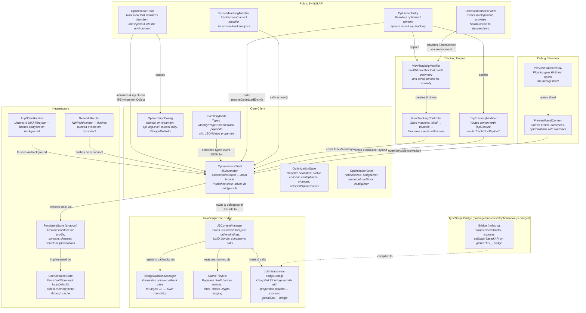
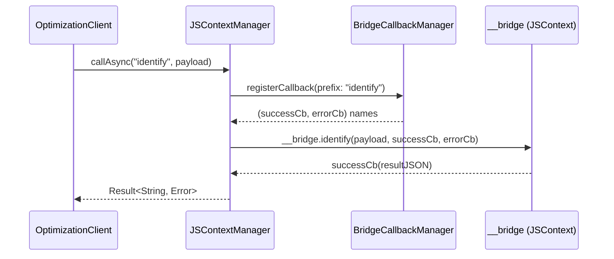
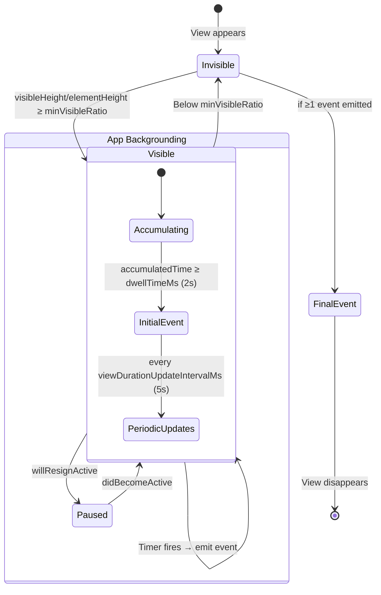

# iOS SDK code map — `packages/ios/`

## High-level overview

This directory contains the beta **Contentful Optimization iOS SDK** — a Swift Package (iOS
15+/macOS 12+) that enables content optimization and analytics tracking for native iOS apps. The SDK
runs the existing JavaScript optimization core inside a **JavaScriptCore** context, bridged by a
TypeScript adapter layer. Swift code handles native concerns (persistence, networking, app
lifecycle, SwiftUI integration) while the JS engine handles optimization logic, profile management,
and analytics batching.

The architecture has two main sub-packages:

| Sub-package                                  | Language   | Purpose                                                                                                              |
| -------------------------------------------- | ---------- | -------------------------------------------------------------------------------------------------------------------- |
| `packages/universal/optimization-js-bridge/` | TypeScript | Thin adapter wrapping `CoreStateful` from the optimization library, exposing a callback-based API for JavaScriptCore |
| `ContentfulOptimization/`                    | Swift      | SPM library providing public API, SwiftUI views, tracking, persistence, and the JSContext lifecycle                  |

---

## Component diagram

### Data flow: async bridge call

### JavaScriptCore bridge runtime notes

The shared bridge contract is documented in
[`packages/universal/optimization-js-bridge/BRIDGE_ARCHITECTURE.md`](../universal/optimization-js-bridge/BRIDGE_ARCHITECTURE.md).
The iOS package owns the JavaScriptCore-specific host side of that contract:

- `JSContextManager` creates one `JSContext` for the lifetime of an `OptimizationClient`, registers
  native bindings, evaluates the UMD bundle, validates `globalThis.__bridge`, registers push-back
  globals, and calls `__bridge.initialize(configJSON)`.
- `NativePolyfills` registers Swift-backed `__nativeLog`, `__nativeSetTimeout`,
  `__nativeClearTimeout`, `__nativeRandomUUID`, and `__nativeFetch` globals before the UMD bundle
  evaluates.
- `BridgeCallbackManager` generates the success/error callback-name pairs that async bridge methods
  use when JavaScript promises settle.
- `OptimizationClient` is `@MainActor`, so public bridge calls enter JavaScriptCore from the main
  actor. Fetch and timer completions marshal back to the main queue before re-entering JS.
- The push-back globals (`__nativeOnStateChange`, `__nativeOnEventEmitted`,
  `__nativeOnEventBlocked`, `__nativeOnFlagValueChanged`, and `__nativeOnOverridesChanged`)
  republish bridge state into Swift observables after decoding JSON.

### Bundle resource and diagnostics notes

`Package.swift` declares `optimization-ios-bridge.umd.js` as a copied Swift Package resource and
links JavaScriptCore for consuming apps. `JSContextManager.loadBundleSource()` reads that resource
from `Bundle.module` and throws `OptimizationError.resourceLoadError` if the bundle is missing.

The copied UMD bundle is generated from `packages/universal/optimization-js-bridge`. Keep the flow
one-way: edit the TypeScript bridge or polyfill source, build the bridge package, and let the bridge
build refresh the Swift Package resource. Do not hand-edit the copied UMD resource.

Diagnostics flow through two channels:

- JavaScriptCore exceptions route through the context exception handler and the SDK diagnostic
  logger.
- Native fetch crossings are bracketed with signposts under the `com.contentful.optimization`
  performance log so Instruments can measure bridge round-trip cost without SDK-code timing hooks.

### Data flow: view tracking lifecycle

---

## Testing

### What's covered (63 test methods, ~1030 lines)

| Area                                                      | Tests                                                                                                                                                                                                                         | Coverage |
| --------------------------------------------------------- | ----------------------------------------------------------------------------------------------------------------------------------------------------------------------------------------------------------------------------- | -------- |
| **OptimizationConfig**                                    | Serialization, defaults, nil URL omission                                                                                                                                                                                     | 3 tests  |
| **OptimizationState**                                     | Empty state, equality (incl. multi-key dictionaries), inequality                                                                                                                                                              | 4 tests  |
| **OptimizationError**                                     | All error case descriptions                                                                                                                                                                                                   | 1 test   |
| **Polyfill availability**                                 | console/setTimeout/clearTimeout/fetch/crypto/URL/AbortController/TextEncoder present after init                                                                                                                               | 1 test   |
| **BridgeCallbackManager**                                 | Unique ID generation, auto-cleanup after invocation                                                                                                                                                                           | 2 tests  |
| **JSContextManager**                                      | Initialize, destroy, getProfile, getState                                                                                                                                                                                     | 4 tests  |
| **OptimizationClient**                                    | Initial state, initialize, destroy, pre-init no-ops, not-initialized throws for all async methods (identify, page, screen, flush, trackView, trackClick), consent/reset/setOnline passthrough, resolveOptimizedEntry baseline | 14 tests |
| **Event payloads / TrackViewPayload / TrackClickPayload** | JSON serialization, typed `JSONValue` properties, optional field omission                                                                                                                                                     | 5 tests  |
| **Event Stream**                                          | Events flow through Combine publisher                                                                                                                                                                                         | 1 test   |
| **Selected Optimizations**                                | State updates propagate to published property                                                                                                                                                                                 | 1 test   |
| **TrackingMetadata**                                      | Extraction from entry/selectedOptimization dicts, defaults                                                                                                                                                                    | 2 tests  |
| **TrackingConfig**                                        | Default values, custom values                                                                                                                                                                                                 | 2 tests  |
| **ScrollContext**                                         | Defaults, equality, inequality, coordinate space name                                                                                                                                                                         | 4 tests  |
| **ViewTrackingController**                                | Initially invisible, becomes visible above minVisibleRatio, stays invisible below, disappear resets, pause/resume, partial overlap, zero height ignored, scrolled past element, new cycle reset                               | 9 tests  |
| **Optimization**                                          | Resolves baseline with no selected optimizations                                                                                                                                                                              | 1 test   |
| **NativePolyfills.TimerStore**                            | Isolation, cancelAll, fired-removes-entry                                                                                                                                                                                     | 3 tests  |
| **Timer lifecycle**                                       | Register returns separate stores, destroy cancels timers                                                                                                                                                                      | 2 tests  |

### Plausible gaps

- **Integration tests with real JS execution**: Most client tests use mocked JS contexts. End-to-end
  tests that exercise the full polyfill → UMD → bridge pipeline are limited to JSContextManager
  init/destroy.
- **ViewTrackingModifier / TapTrackingModifier**: No SwiftUI snapshot or UI tests for the modifier
  wrappers themselves (controller logic is tested in isolation).
- **PreviewPanel**: No tests for the debug panel views or override flows.
- **AppStateHandler / NetworkMonitor**: No tests for lifecycle event handling or network
  reconnection flushing.
- **UserDefaultsStore**: No explicit tests for persistence round-trips (load/save/clear).
- **Concurrent/reentrancy scenarios**: The `identify` continuation guard is tested implicitly but
  multi-call race conditions aren't explicitly covered.
- **Error paths in NativePolyfills.fetch**: Edge cases like network timeouts or malformed responses
  through the native fetch polyfill.
