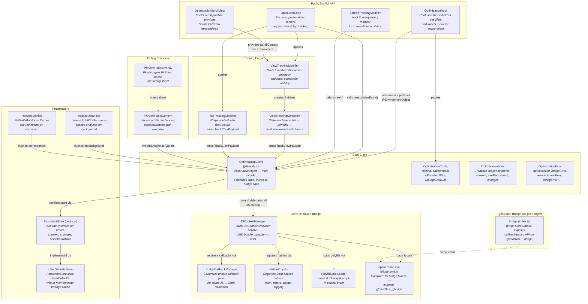
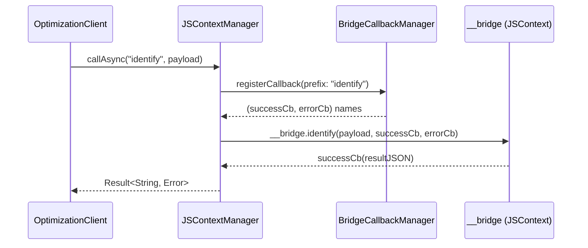
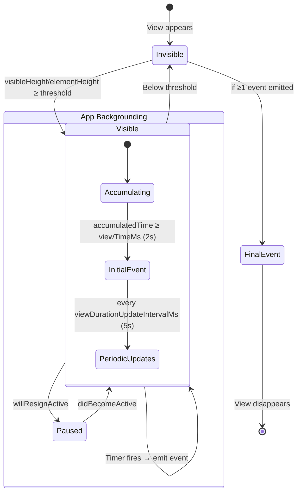

# iOS SDK Code Map — `packages/ios/`

## High-Level Overview

This diff introduces a complete **Contentful Optimization iOS SDK** — a Swift Package (iOS 15+/macOS
12+) that enables content personalization and analytics tracking for native iOS apps. The SDK runs
the existing JavaScript optimization core inside a **JavaScriptCore** context, bridged by a
TypeScript adapter layer. Swift code handles native concerns (persistence, networking, app
lifecycle, SwiftUI integration) while the JS engine handles personalization logic, profile
management, and analytics batching.

The architecture has two main sub-packages:

| Sub-package               | Language   | Purpose                                                                                                              |
| ------------------------- | ---------- | -------------------------------------------------------------------------------------------------------------------- |
| `ios-jsc-bridge/`         | TypeScript | Thin adapter wrapping `CoreStateful` from the optimization library, exposing a callback-based API for JavaScriptCore |
| `ContentfulOptimization/` | Swift      | SPM library providing public API, SwiftUI views, tracking, persistence, and the JSContext lifecycle                  |

---

## Component Diagram

### Data Flow: Async Bridge Call

### Data Flow: View Tracking Lifecycle

---

## Testing

### What's Covered (63 test methods, ~1030 lines)

| Area                                     | Tests                                                                                                                                                                                                                    | Coverage |
| ---------------------------------------- | ------------------------------------------------------------------------------------------------------------------------------------------------------------------------------------------------------------------------ | -------- |
| **OptimizationConfig**                   | Serialization, defaults, nil URL omission                                                                                                                                                                                | 3 tests  |
| **OptimizationState**                    | Empty state, equality (incl. multi-key dictionaries), inequality                                                                                                                                                         | 4 tests  |
| **OptimizationError**                    | All error case descriptions                                                                                                                                                                                              | 1 test   |
| **PolyfillScriptLoader**                 | Loads all 8 scripts in order                                                                                                                                                                                             | 1 test   |
| **BridgeCallbackManager**                | Unique ID generation, auto-cleanup after invocation                                                                                                                                                                      | 2 tests  |
| **JSContextManager**                     | Initialize, destroy, getProfile, getState                                                                                                                                                                                | 4 tests  |
| **OptimizationClient**                   | Initial state, initialize, destroy, pre-init no-ops, not-initialized throws for all async methods (identify, page, screen, flush, trackView, trackClick), consent/reset/setOnline passthrough, personalizeEntry baseline | 14 tests |
| **TrackViewPayload / TrackClickPayload** | JSON serialization, optional field omission                                                                                                                                                                              | 4 tests  |
| **Event Publisher**                      | Events flow through Combine publisher                                                                                                                                                                                    | 1 test   |
| **Selected Personalizations**            | State updates propagate to published property                                                                                                                                                                            | 1 test   |
| **TrackingMetadata**                     | Extraction from entry/personalization dicts, defaults                                                                                                                                                                    | 2 tests  |
| **TrackingConfig**                       | Default values, custom values                                                                                                                                                                                            | 2 tests  |
| **ScrollContext**                        | Defaults, equality, inequality, coordinate space name                                                                                                                                                                    | 4 tests  |
| **ViewTrackingController**               | Initially invisible, becomes visible above threshold, stays invisible below, disappear resets, pause/resume, partial overlap, zero height ignored, scrolled past element, new cycle reset                                | 9 tests  |
| **Personalization**                      | Resolves baseline with no personalizations                                                                                                                                                                               | 1 test   |
| **NativePolyfills.TimerStore**           | Isolation, cancelAll, fired-removes-entry                                                                                                                                                                                | 3 tests  |
| **Timer lifecycle**                      | Register returns separate stores, destroy cancels timers                                                                                                                                                                 | 2 tests  |

### Plausible Gaps

- **Integration tests with real JS execution**: Most client tests use mocked JS contexts. End-to-end
  tests that exercise the full polyfill → UMD → bridge pipeline are limited to JSContextManager
  init/destroy.
- **ViewTrackingModifier / TapTrackingModifier**: No SwiftUI snapshot or UI tests for the modifier
  wrappers themselves (controller logic is tested in isolation).
- **PreviewPanel**: No tests for the debug panel views or override flows.
- **AppStateHandler / NetworkMonitor**: No tests for lifecycle event handling or network
  reconnection flushing.
- **UserDefaultsStore**: No explicit tests for persistence round-trips (load/save/clear).
- **Concurrent/reentrancy scenarios**: The `identify` continuation guard is tested implicitly but
  multi-call race conditions aren't explicitly covered.
- **Error paths in NativePolyfills.fetch**: Edge cases like network timeouts or malformed responses
  through the native fetch polyfill.
